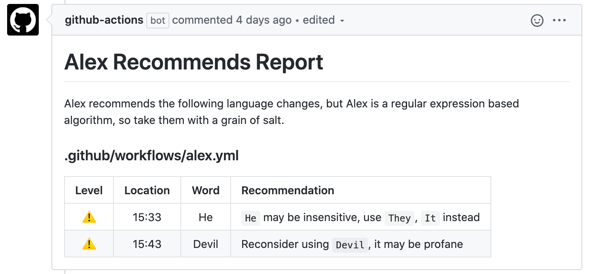
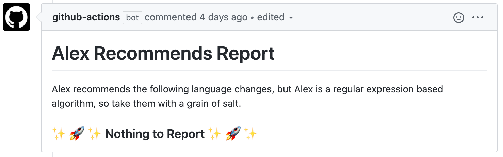

# Alex Recommends

Uses [alex](https://alexjs.com/) to check language and post a comment on the pull request with the recommendations.

### Alex recommends changes


### Alex has no changes to recommend


## Inputs

### `GITHUB_TOKEN`

**Required** `{{ secrets.GITHUB_TOKEN }}`


### `message_id`

**Optional** a string identifier to add as a comment on the message.  Only one message with a given `message_id` will be posted to a PR.  If you are using this action multiple times within a workflow, it is recommended to customize the `message_id`.  Default is `"Default"`.


### `no_binary`
**Optional** Alex noBinary configuration option - if false items like `he or she` will not be corrected to `they` [default: true]

### `profanity_sureness`
**Optional** Alex profanitySureness configuration option - 0=unlikely, 1=maybe, 2=likely [default: 1]

### `glob_pattern`
**Optional** A glob pattern to filter files for [default: "\*"]


### `pr_only`
**Optional** Only evaluate files that were changed in this Pull Request [default: true]

## Outputs

None

## Example `workflow.yml`

This workflow runs when a PR is made.  It then comments with the results of `alex` or updates a past comment, if available (based on `message_id`).

```
name: Alex Recommends

on: pull_request

jobs:
  alex:
    runs-on: ubuntu-latest

    steps:
    - uses: actions/checkout@v2
    - name: Use Node.js
      uses: actions/setup-node@v1
      with:
        node-version: 12.x
    - name: Comment on new PR
      uses: brown-ccv/gh-actions/alex-recommends@master
      with:
        GITHUB_TOKEN: ${{ secrets.GITHUB_TOKEN }}
        message_id: 'alex'
        no_binary: false
        profanity_sureness: 2
        pr_only: false
        glob_pattern: "services/**"
```
